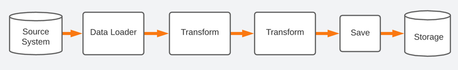

= Simple Pipeline API

== Overview

From the functional perspective, all data processing applications are pretty similar and can be introduced as a pipeline of sequential operations(stages) performed on input data/stream.
Generally speaking, we need to read data, apply some transformation and save results to the storage.
Data sources, formats, transformations can be different. However, we can identify sequential operations applied to the inbound dataset.

The library provides major components to construct, configure and run simple data processing pipelines.

== Getting Started

Run next command to build and install simple-pipeline library to the local Maven repository

    mvn -f simple-pipeline-api/pom.xml clean install

After this you can include this library to the project as a regular maven dependency

    <dependency>
        <groupId>os.toolset</groupId>
        <artifactId>simple-pipeline-api</artifactId>
        <version>1.0.0</version>
    </dependency>

=== Creating a custom data processing pipeline
As mentioned before, any pipeline is nothing but a sequence of the stages executed in the predefined order.

Stages in a pipeline represent the logical steps needed to process data. Each stage represents a single high-level processing concept such as reading files, loading data from external storage, computing a product from the data, writing data to the database, etc.

Instead of predefined stages embedded into the pipeline framework plug-in architecture can be used. The main idea behind this architecture is to allow adding additional features(stages) as plugins to the core application (pipeline execution framework).

`java.util.ServiceLoader` is used to discover and load new stages in the runtime. Pipeline configuration defines which stages should be included to the pipeline and sets the execution order.

==== Simple Stage Code
[source,java]
----
/**
 * java.util.ServiceLoader requires all implementations to be registered as a service using META-INF metadata.
 * However, it is easy for to forget to update or correctly specify the service descriptors.
 * AutoService annotation processor generates this metadata for the developer, for any class annotated with @AutoService
*/
@AutoService(Stage.class)
public class GreetingStage implements Stage<Context<String>> {
    @Override
    public String name() {
        return "greet";
    }

    @Override
    public void run(Context<String> context) throws ExecutionError {
        // Loading stage configs
        StageConfig stageConfig = stageConfig(context);
        String message = stageConfig.getString("message").required();
        //Execution context can be used to share data between stages
        String username = context.getSnapshot("username");

        System.out.println(format(message, username));

    }
}

----

==== Configuration
The following configuration file can be used to configure a pipeline that reads CSV files and saves records in JSON format.

[source, hocon]
----
pipeline.name: "CSV to JSON Converter"
steps:[
  {
    name: read-csv
    sep: ","
    headers: true
    path: "file.csv"
    dataset.id: csv
  }
  {
    name: save-as-json
    dataset.id: csv
    path: "file.json"
  }
]
----

== License
    MIT License
    Copyright (c) 2019 Oleksandr Sluchyk